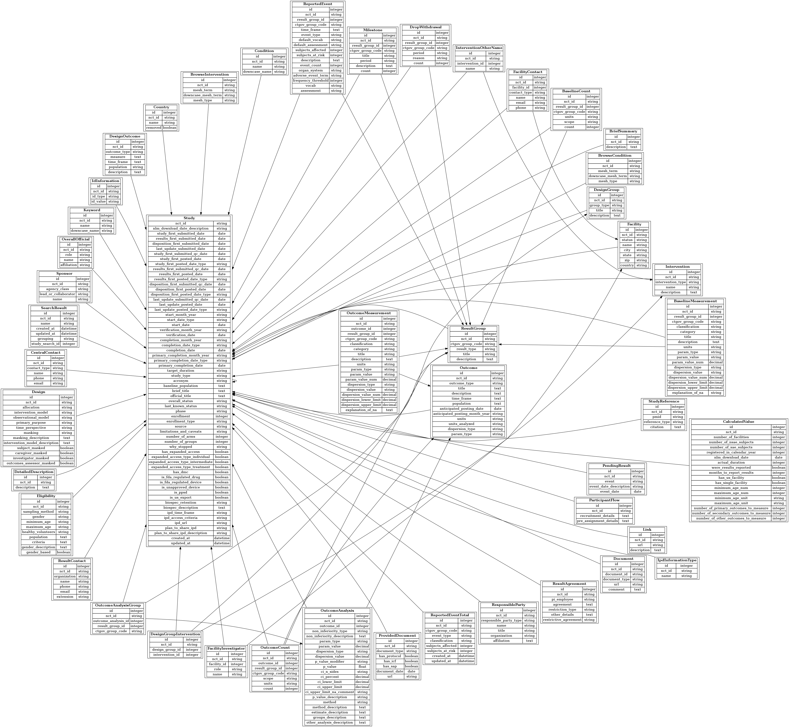

# Overview
> **Note** All information in this file is from the [AACT](https://aact.ctti-clinicaltrials.org/) information pages, which are copyrighted by the CTTI.  The information is reproduced here for convenience

AACT is a publicly available relational database that contains all information (protocol and result data elements) about every study registered in ClinicalTrials.gov. Content is downloaded from ClinicalTrials.gov daily and loaded into AACT. The Clinical Trials Transformation Initiative (CTTI) enhanced AACT in October, 2016 to include the following features:
- Database content refreshed daily
- Database directly accessible in the cloud
- Static copies of the database available for download
- Open source tools freely available (postgreSQL, Ruby on Rails, Tableau Public)
- Source code available via Github

## AACT Database Schema

Each table includes the unique identifier assigned by ClinicalTrials.gov: nct_id. This provides a way to find all data about a particular study and serves as the key that joins related information across multiple tables. Every table (except Studies) also includes an id column which uniquely identifies each row in the table. In most cases, you need to use the nct_id to join tables.

### Naming Conventions
- Table names are all plural. (ie. studies, facilities, interventions, etc.)
- Column names are all singular. (ie. description, phase, name, etc.)
- Table/column names derived from multiple words are delimited with underscores. (ie. mesh_term, study_first_submitted_date, number_of_groups, etc.)
- Case (upper vs lower) is not relevant since PostgreSQL ignores case. Studies, STUDIES and studies all represent the same table and can be used interchangeably.
- Information about study design entered into ClinicalTrials.gov during registration is stored in AACT tables prefixed with Design_ to distinguish it from the results data. For example, the Design_Groups table contains registry information about anticipated participant groups, whereas the Result_Groups table contains information that was entered after the study has completed to describe actual participant groups. Design_Outcomes contains information about the outcomes to be measured and Outcomes contains info about the actual outcomes reported when the study completed.
- Where possible, tables & columns are given fully qualified names; abbreviations are avoided. (ie. description rather than desc; category rather than ctgry)
-Unnecessary and duplicate verbiage is avoided. For example: Studies.source instead of Studies.study_source
- Columns that end with _id represent foreign keys. The prefix to the _id suffix is always the singular name of the parent table to which the child table is related. 
  - These foreign keys always link to the id column of the parent table. `Child_Table.parent_table_id = Parent_Tables.id` 
  - For example, a row in Facility_Contacts links to it’s facility through the facility_id column: `Facility_Contacts.facility_id = Facilities.id`

### Structural Conventions
- Every table has an nct_id column to link rows to its related study in the Studies table. All study-related data can be linked directly to the Studies table via the nct_id. (Note: The schema diagram omits several of the lines that represent relationships to Studies. This was done to avoid appearing complex and confusing. Relationships to the Studies table can be assumed since every table includes the NCT ID.) `Studies.nct_id = Outcomes.nct_id` will link outcomes to their related study.
- Every table has the primary key: id. (Studies is the one exception since it's primary key is the unique study identifier assigned by ClinicalTrials.gov: nct_id.)
- Columns that end with _date contain date-type values.
- Columns that contain month/year dates are saved as character strings in a column with a _month_year suffix. A date-type estimate of the value (using the 1st of the month as the 'day') is stored in an adjacent column with the _date suffix. (This applies to date values in the Studies table.)
- Derived/calculated values are stored in the Calculated_Values table.

**While the AACT tries to rigorously adhere to these conventions, reality occasionally failed to cooperate, so compromises were made and exceptions to these rules exist.** For example, to limit duplicate verbiage, the table name References was preferred over Study_References, however the word 'References' is a PostgreSQL reserved word and cannot be used as a table name, so Study_References it is.

### How are arms/groups identified?

Considerable thought went into how to present arm and group information to facilitate analysis by simplifying naming and data structures while retaining data fidelity. NLM defines groups/arms this way:
1) Arm: A pre-specified group or subgroup of participant(s) in a clinical trial assigned to receive specific intervention(s) (or no intervention) according to a protocol.
2) Group: The predefined participant groups (cohorts) to be studied, corresponding to Number of Groups specified under Study Design (for single-group studies.

In short, observational studies use the term ‘groups’; interventional studies use ‘arms’, though for the purpose of analysis, they both refer to the same thing. Because 'group' is more intuitive to the general public, AACT standardized on the term 'group(s)' and does not use the term 'arms'.

### Participant Groups: Registry vs Results

When a study is registered in ClinicalTrials.gov, information is entered about how the study defines participant groups. In AACT, this information is stored in the Design_Groups table, while info about actual groups that is entered after the study has completed is stored in the Result_Groups table. (AACT has not attempted to link data between these 2 tables.)

Result information, for the most part, is organized in ClinicalTrials.gov by participant group. Result_Contacts & Result_Agreements are the only result tables not associated with groups. This section describes how AACT has structured group-related results data.

AACT provides four general categories of result information:
- Participant Flow (Milestones & Drop/Withdrawals)
- Baselines
- Outcomes
Reported Events
The Result_Groups table represents an aggregate list of all groups associated with these result types. All result tables (Outcomes, Outcome_Counts, Baseline_Measures, Reported_Events, etc.) relate to Result_Groups via the foreign key result_group_id.

For example, Outcomes.result_group_id = Result_Groups.id.

ClinicalTrials.gov assigns an identifier to each group/result that is unique within the study. The identifier includes two leading characters that represent the type of result (BG for Baseline, OG for Outcomes, EG for Reported Event, and FG for Participant Flow) followed by a three digit number starting with 000 that uniquely identifies the group in that context. To illustrate assume that study NCT001 had 2 groups: experimental & control, and reported multiple baseline measures, outcome measures, reported events and milestone/drop-withdrawals for each group. The following table illustrates how the Result_Groups table organizes the group information received from ClinicalTrials.gov in this case:

| id | nct_id | result_type | ctgov_group_code | group_title | explanation |
|---|---|---|---|---|---|
| 1 | NCT001 | Baseline | BG000 | Experimental Group | All Baseline_Measures associated with this study's experimental group link to this row. |
| 2 | NCT001 | Baseline | BG001 | Control Group | All Baseline_Measures associated with this study's control group link to this row. |
| 3 | NCT001 | Outcome | OG001 | Experimental Group | All Outcome_Measures associated with this study's experimental group link to this row. |
| 4 | NCT001 | Outcome | OG000 | Control Group | All Outcome_Measures associated with this study's control group link to this row. |
| 5 | NCT001 | Reported Event | EG000 | Experimental Group | All Reported_Events associated with this study's experimental group link to this row. |
| 6 | NCT001 | Reported Event | EG001 | Control Group | All Reported_Events associated with this study's control group link to this row. |
| 7 | NCT001 | Participant Flow | FG000 | Experimental Group | All Milestones & Drop_Withdrawals associated with this study's experimental group link to this row. |
| 8 | NCT001 | Participant Flow | FG001 | Control Group | All Milestones & Drop_Withdrawals associated with this study's control group link to this row. |

>Notice that the integer in the code provided by ClinicalTrials.gov (ctgov_group_code) is often the same for one group across the different result types, but this is not always the case. In the example above, BG000, EG000 & FG000 all represent the 'experimental group', so you're tempted to think that '000' equates to to the 'experimental group' for this study, however for Outcomes, OG000 represents the control group. In short, the number in the ctgov_group_code often links the same group across all result types in a study, **but for about 25% of studies, this is not the case, so it can't be counted on to indicate this relationship.**

### Information about dates
When clinicaltrials.gov started tracking studies, it only tracked the month & year for some fields and not the day for several date values including start date, completion date, primary completion date and verification date. Because day is not provided for some studies, AACT stores these dates in the studies table as character type rather than date type values. Character type dates are of limited utility in an analytic database because they can’t be used to perform standard date calculations such as determining study duration or the average number of months for someone to report results or identify studies registered before/after a certain date.

There are 2 columns in the Studies table for each date element:
- A character-type column that displays the value exactly as it was received from ClinicalTrials.gov
- A date-type column that can be used for date calculations.
- If the date received from ClinicalTrials.gov has only month/year, in order to convert the string to a date, it is assigned the first day of the month. For example, a study with start date “June 2014” will have “June 2014” in the start_month_year column and “06/01/14” in the start_date column.

### Information about dates related to 'pending results'
On May 9, 2018, the NLM added a new section of date information to the ClinicalTrials.gov API. The section is labeled "pendng_results" and serves to provide information about result submission activity while the results await quality control review.

NLM provides result submission date(s) for studies that have results awaiting quality control (QC) review. The results themselves are not publicly posted until the review is complete. The dates for three types of events related to results submission are reported in the Pending_Results table:

Submission: The date(s) that study results were submitted to NLM for QC review.
Submission Canceled: The date(s) that such submissions were canceled by the data provider. (Note: this value is set to "Unknown" if the cancellation occurred before 05/08/2018 when this data started to be collected).
Returned: The date(s) that study results were returned to the data provider because they required modification.
The NLM reports that the following updates occur to this information when a study passes the quality control review:

Study.results_first_submitted_date is populated with the earliest 'submitted date' from Pending_Results.
Study.results_first_submitted_qc_date is populated with the submitted date of the version of results that passed QC.
Result tables (Reported_Events, Outcomes, Baseline_Measurements, etc.) are populated with the result information that passed QC.
All rows for the study with reviewed/approved results are removed from the Pending_Events table.
More information about the quality control (QC) review process and how this information is presented in ClinicalTrials.gov can be found in the December, 2017 NLM Technical Bulletin

### Information about trial sites (Facilities and Countries)
Information about organizations where the study is/was conducted (aka. facilities, trial sites) is stored in the Facilities table. This represents the facility information that was included in the study record on the date that information was downloaded from ClinicalTrials.gov.

The name and email/phone for the contact person (and optionally, a backup contact) at a facility is available if the facility status (Facilities.status) is ‘Recruiting’ or ‘Not yet recruiting’, and if the data provider has provided such information. This information is stored in AACT in the Facility_Contacts table, which is a ‘child’ of the Facilities table. Facility-level contact information is not required if a central contact has been provided. Contact information is removed from the publicly available content at ClinicalTrials.gov (and therefore from AACT) when the facility is no longer recruiting, or when the overall study status (Studies.overall_status) changes to indicate that the study has completed recruitment.

Similarly, the names and roles of investigators at the facility are available if the facility status (Facilities.status) is ‘Recruiting’ or ‘Not yet recruiting’, and if the data provider has provided such information. This information is stored in AACT in the Facility_Investigators table, which is a ‘child’ of the Facilities table. Facility-level investigator information is optional. Facility-level investigator information is removed from the publicly available content at ClinicalTrials.gov (and therefore from AACT) when the facility is no longer recruiting, or when the overall study status (Studies.overall_status) changes to indicate that the study has completed recruitment.

AACT includes a Countries table, which contains one record per unique country per study. The Countries table includes countries currently & previously associated with the study. The removed column identifies those countries that are no longer associated with the study. NLM uses facilities information to create a list of unique countries associated with the study. In some cases, ClinicalTrials.gov data submitters subsequently remove facilities that were entered when the study was registered. Naturally these will not appear in AACT's Facilities table. If all of a country’s facilities have been removed from a study, NLM flags the country as ‘Removed’ which appears in AACT as Countries.removed = true.

The reasons facilities are removed are varied and unknown. A site may have been removed because it was never initiated or because it was entered with incorrect information. The recommended action for sites that have completed or have terminated enrollment is to change the enrollment status to “Completed” or “Terminated”; however, such sites are sometimes deleted from the study record by the responsible party. Data analysts may consider using Countries where removed is set to true to supplement the information about trial locations that is contained in Facilities, particularly for studies that have completed enrollment and have no records in Facilities.

Users who are interested in identifying countries where participants are being/were enrolled may use either the Facilities or Countries (where Countries.removed is not true) with equivalent results.

### “Delayed Results” data elements are available in AACT
A responsible party of an applicable clinical trial may delay the deadline for submitting results information to ClinicalTrials.gov for up to two additional years if one of the following two certification conditions applies to the trial:

Initial approval: trial completed before a drug, biologic or device studied in the trial is initially approved, licensed or cleared by the FDA for any use.

New use: the manufacturer of a drug, biologic or device is the sponsor of the trial and has filed or will file within one year, an application seeking FDA approval, licensure, or clearance of the new use studied in the trial. A responsible party may also request, for good cause, an extension of the deadline for the submission of results.
Studies for which a certification or extension request have been submitted include the date of the first certification or extension request in the data element: Studies.disposition_first_submitted_date.